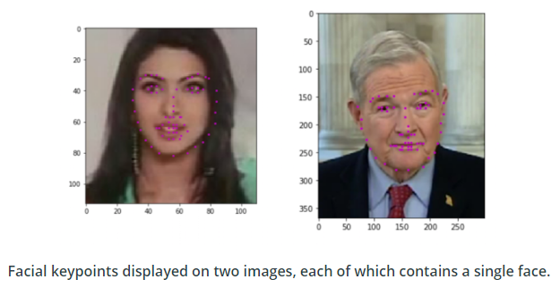

# Project : Facial Keypoint Detection

## Description
In this project, we build a facial keypoint detection system 
that takes in any image with faces, and predicts the location
of 68 distinguishing keypoints on each face.

Facial keypoints include points around the eyes, nose, and mouth on a face and are used in many applications. These applications include: facial tracking, facial pose recognition, facial filters, and emotion recognition. 

Some examples of these keypoints are pictured below.

## Files

* `Notebook 1`: Loading and visualizing the facial keypoint data
* `Notebook 2`: Defining and Training a Convolutional Neural Network (CNN) to predict facial keypoints
* `Notebook 3`: Facial keypoint detection using haar cascades and the trained CNN
* `Notebook 4`: Fun filters and keypoints uses
* `models.py`: Define the neural network architectures 
* `data_load.py`: Data transforms classes

## Data Augmentation

A common strategy for training neural networks is to introduce randomness in the input data itself. For example, you can randomly rotate, mirror, scale, and/or crop your images during training. This will help your network generalize as it's seeing the same images but in different locations, with different sizes, in different orientations, etc.

In this project, we have to be cautious of the kind of augmentation we choose to apply, since it will have a consequence to change the keypoints locations. We will only use random cropping to augment our train data which is implemented in`data_load`

## Transforms
We only augment our train dataset to be able to learn underlying patterns for achieving better results on the test dataset.

### Train dataset
With that in mind, here is how the pipeline to transform the train dataset looks like:
* Rescale the image to (250, 250) for the width and height
* Random crop the image to (227, 227)
* Normalize : convert color image to grayscale and normalize the color range to [0, 1] as well as scale keypoints around 0 with a range of [-1, 1]
* Convert to tensor

### Test dataset
 * Rescale the image to (227, 227) for the width and height
 *  Normalize : convert color image to grayscale and normalize the color range to [0, 1] as well as scale keypoints around 0 with a range of [-1, 1]
* Convert to tensor

## Model architecture
I first tried **Naimish** architecture from the paper 
`Facial Key Points Detection using Deep Convolutional Neural Network, N. Agarwal et al. (2016)` but it turns out that the model takes an input image of size (96, 96) which is fairly small compared to the size of our original images, so at the end we lose a lot of information by rescaling directly to this size.

I then turned towards one of the model that has given rise to the deep learning field, which is **AlexNet**. The *AlexNet* CNN architecture, `ImageNet Classification with Deep Convolutional Neural Networks, A. Krizhevsky et al. (2012)`, won the 2012 ImageNet ILSVRC challenge by a large margin: it achieved 17% top-5 error rate while the second best achieved only 26% ! 

However, I did change the activation functions and added some regularization techniques that helped improve the model.

| Layer               	| Details                                                                                          	|
|---------------------	|--------------------------------------------------------------------------------------------------	|
| Input               	| size : (227, 227, 1)                                                                             	|
| Conv 1              	| # filters : 96;  kernel size : (4 x 4);  stride : (4 x 4);   padding : 0;   activation : ELU          	|
| Max Pooling         	| kernel size : (3 x 3);  stride : (2 x 2);  padding : 0 (VALID)                                     	|
| Dropout             	| probability : 0.2                                                                                	|
| Conv 2              	| # filters : 256;  kernel size : (5 x 5);  stride : (1 x 1);   padding : 2 (SAME);   activation : ELU 	|
| Batch Normalization 	| # num_features: 256                                                                                  	|
| Max Pooling         	| kernel size : (3 x 3);  stride : (2 x 2);  padding : 0 (VALID)                                     	|
| Conv 3              	| # filters : 384;  kernel size : (3 x 3); stride : (1 x 1);  padding : 1 (SAME); activation : ELU   	|
| Batch Normalization 	| # num_features: 384                                                                                  	|
| Dropout             	| probability : 0.4                                                                                	|
| Conv 4              	| # filters : 384;  kernel size : (3 x 3);  stride : (1 x 1);   padding : 1 (SAME);   activation : ELU  	|
| Batch Normalization 	| # filters : 384                                                                                  	|
| Dropout             	| probability : 0.4                                                                                	|
| Conv 5              	| # filters : 384;  kernel size : (3 x 3);  stride : (1 x 1);   padding : 1 (SAME);   activation : ELU  	|
| Batch Normalization 	| # num_features: 384                                                                                  	|
| Dropout             	| probability : 0.4                                                                                	|
| Flatten             | (6 x 6 x 256) => 9216               |
| Fully Connected 1   | # neurons : 4096; activation : ELU   |
| Batch Normalization | # num_features: 4096                |
| Dropout             | probability : 0.6                   |
| Fully Connected 2   | # neurons : 4096; activation : ELU   |
| Batch Normalization | # num_features: 4096                |
| Dropout             | probability : 0.6                   |
| probability : 0.6   | # neurons : 136; activation : None |
| Output              | size : (136 x 1)                    |

