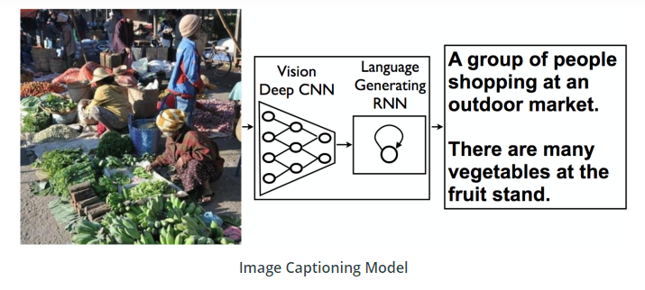

# Project : Image Captioning

## Description
In this project we combine Convolutional Neural Networks (CNN) and Recurrent Neural Networks (RNN) knowledge to build a deep learning model that produces captions given an input image. 

Image captioning requires that you create a complex deep learning model with two components: a CNN that
transforms an input image into a set of features, and an RNN that turns those features into rich, descriptive
language.

One such example of how this architecture performs is pictured below: 
<!--  -->

  

## Files
* `Notebook 0`: Explore MS COCO dataset using COCO API
* `Notebook 1`: Load and pre-process data from the MS COCO dataset and design the CNN-RNN model for automatically generating image captions
* `Notebook 2`: Training phase of the CNN-RNN model 
* `Notebook 3`: Using the previously trained model to generate captions for images in the test dataset.
* `data_loader.py` : Custom data loader for PyTorch combining the dataset and the sampler
* `vocabulary.py` : Vocabulary constructor built from the captions in the training dataset
* `vocab.pkl` : Vocabulary file stored to load it immediately from the data loader

## CNN Encoder
The encoder is based on a Convolutional neural network that encodes an image into a compact representation.

The CNN-Encoder is a **ResNet** (Residual Network). These kind of network help regarding to the vanishing and exploding gradient type of problems. The main idea relies on the use of <ins>skip connections</ins> which allows to take the activations from one layer and suddenly feed it to another layer, even much deeper in the neural network and using that, we can build ResNets which enables to train very deep networks. In this project I used the ResNet-152 pre-trained model, which among those available from PyTorch : https://pytorch.org/docs/master/torchvision/models.html , is the one that is performing best on the ImageNet dataset. 

This might seem unrelated to judge the architecture to use in the encoder based on the accuracy on a totally different dataset, but what I found interesting is that in section **5.2. Evaluation Procedures** of the paper `Neural Image Caption Generation with Visual Attention (2015)`, the authors found that using more recent architectures such as GoogLeNet (Inception) (winner ILSVRC 2014) or Oxford VGG (3rd place ILSVRC 2014) can give a boost in performance over using the AlexNet (winner ILSVRC 2012). So encoder architecture matter !

<!-- -->

  

## RNN Decoder
The CNN encoder is followed by a recurrent neural network that generates a corresponding sentence.

The RNN-Decoder consists in a <ins>single LSTM layer</ins> followed by <ins>one fully-connected (linear) layer</ins>, this architecture was presented from the paper `Show and Tell: A Neural Image Caption Generator (2014)` https://arxiv.org/pdf/1411.4555.pdf (figure **3.1**)

<!--  -->

  

## CNN-RNN model 
Now that we have our chosen architecture for the encoder and the decoder, we can look at the whole picture of
our image captioning system !

By merging the CNN encoder and the RNN decoder, we can get a model that can find patterns in images and then use that information to help generate a description of those images. The input image will be processed by a CNN and we will connect the output of the CNN to the input of the RNN which will allow us to generate descriptive text. 

  

